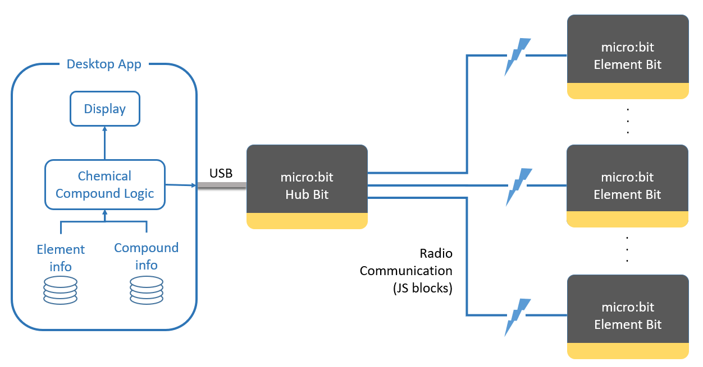

<p align="center">
  </center>
  <br><br>
  <br>
  
  
</p>


Micro:Chem. Bringing Chemistry Teaching into the 21st Century
=============================================================
What is Micro:Chem?
-------------------
Micro:Chem is a project designed to make chemistry teaching more fun and interactive with the use of the BBC micro:bit. The premise involves using micro:bits to represent chemical elements or compounds which can then "react" with one another, forming new compounds.

Setup
-----
The standard class setup requires a desktop machine to run the Micro:Chem application, a micro:bit connected to this machine via USB, and a number of other micro:bits, or "ElementBits", which represent the different elements and compounds.

<p align="center">
  
</p>

Installation
------------
To install the Micro:Chem app requires Python 3 and has the following dependencies:

ttkthemes
```
> pip install ttkthemes
```


Note: this list does not include dependencies which are included in standard distributions of Python 3

Usage
-----
The Micro:Chem application can be started by running TeacherInterfaceGUI.py

```
> python teacher_interface/teacher_gui/TeacherInterfaceGUI.py
```